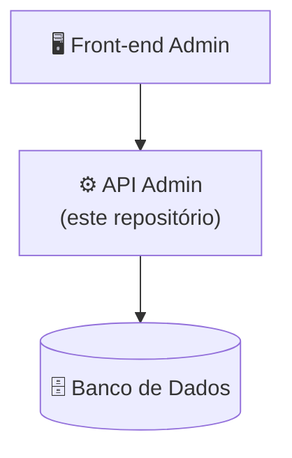

# ⚙️ VibeEco-Back-End-Adm

<p align="center">
  <strong>API Administrativa da plataforma VibeEco</strong>
</p>

---

## 📌 Sobre este repositório

Este repositório contém a **API utilizada pelas funcionalidades administrativas** do VibeEco. Ela é consumida pelo **Front-end Administrativo** e acessa o mesmo banco de dados da API de Usuários.

**Responsável:** Lucas Kolle — [GitHub](https://github.com/Lucas-Kolle)

---

## 🏗️ Posição na arquitetura



---

## 🎯 Responsabilidades

- Autenticação e autorização administrativas;
- Controle de acesso e permissões;
- Implementação das regras de negócio;
- Desenvolvimento dos endpoints;
- Integração com o banco de dados;
- Validação das informações;
- Testes da API.

---

## 🧩 Módulos da API

```text
Autenticação Admin → Controle de acesso → Usuários → Missões → Desafios
→ Conteúdos → Recompensas → Conquistas → Monitoramento → Relatórios
```

### 🔐 Acesso

- Autenticação administrativa;
- Controle de acesso;
- Controle de permissões.

### 👥 Usuários

- Visualização, cadastro, edição e exclusão de usuários;
- Gerenciamento de usuários.

### 🎯 Missões

- Cadastro e edição;
- Definição de objetivos e recompensas;
- Acompanhamento da participação.

### 🏆 Desafios

- Cadastro e edição;
- Definição de objetivos, período e recompensas.

### 📚 Conteúdos

- Cadastro e edição;
- Categorias, anexos, descrição e tipos de conteúdo.

### 🎁 Recompensas e conquistas

- Gerenciamento de recompensas;
- Gerenciamento de conquistas.

### 📈 Monitoramento e relatórios

- Participação dos usuários;
- Atividades, missões e desafios;
- Indicadores e resultados;
- Relatórios.

## ⚙️ Como executar

<!-- TODO: informar linguagem/framework, versões e comandos reais -->

### Pré-requisitos

- `<Linguagem / runtime e versão>`
- Banco de dados do VibeEco em funcionamento (ver [VibeEco-DataBase](https://github.com/pedsousa06-ai/VibeEco-DataBase))

### Passos

```bash
# 1. Clonar o repositório
git clone https://github.com/pedsousa06-ai/VibeEco-Back-End-Adm.git
cd VibeEco-Back-End-Adm

# 2. Instalar as dependências
<comando de instalação>

# 3. Configurar as variáveis de ambiente
cp .env.example .env

# 4. Executar a aplicação
<comando de execução>
```

### Variáveis de ambiente

| Variável | Descrição |
|----------|-----------|
| `<DB_HOST>` | Endereço do banco de dados |
| `<DB_NAME>` | Nome do banco |
| `<DB_USER>` / `<DB_PASSWORD>` | Credenciais do banco |
| `<JWT_SECRET>` | Segredo de autenticação *(se aplicável)* |
| `<PORT>` | Porta da API |

---

## 🧪 Testes

- Testes de endpoints;
- Testes de autenticação e permissões;
- Testes das regras de negócio;
- Testes de integração;
- Testes de erros e validações.

```bash
<comando para executar os testes>
```

---

## 🔐 Segurança

- Acesso restrito a administradores autenticados;
- Controle de permissões por perfil;
- Validação dos dados recebidos;
- Proteção das credenciais (nunca versionar o `.env`);
- Comunicação segura entre os componentes.

---

## 📊 Status

🚧 **Em desenvolvimento**

- [ ] Autenticação e permissões
- [ ] Gerenciamento de usuários
- [ ] Gerenciamento de missões e desafios
- [ ] Gerenciamento de conteúdos
- [ ] Recompensas e conquistas
- [ ] Monitoramento e relatórios
- [ ] Integração com o banco
- [ ] Testes

---

## 🌱 Sobre o VibeEco

O **VibeEco** é uma plataforma digital desenvolvida pela **TechProton** para promover a conscientização e o engajamento em sustentabilidade, por meio de conteúdos educativos, missões, desafios, gamificação e interação social.

🔗 **Repositório principal:** [VibeEco](https://github.com/pedsousa06-ai/VibeEco)

### 📦 Repositórios do projeto

| Área | Repositório | Responsável |
|------|-------------|-------------|
| 🗄️ Banco de Dados | [VibeEco-DataBase](https://github.com/pedsousa06-ai/VibeEco-DataBase) | Ryller Feitosa |
| ⚙️ Back-end Usuários | [VibeEco-Back-End-Users](https://github.com/pedsousa06-ai/VibeEco-Back-End-Users) | Lucas Kolle |
| ⚙️ Back-end Administrativo | [VibeEco-Back-End-Adm](https://github.com/pedsousa06-ai/VibeEco-Back-End-Adm) | Lucas Kolle |
| 🖥️ Front-end Usuários | [VibeEco-Front-End-Users](https://github.com/pedsousa06-ai/VibeEco-Front-End-Users) | Gabriel Sousa |
| 🖥️ Front-end Administrativo | [VibeEco-Front-End-Adm](https://github.com/pedsousa06-ai/VibeEco-Front-End-Adm) | Gabriel Sousa |
| 📱 Mobile | [VibeEco-Mobile](https://github.com/pedsousa06-ai/VibeEco-Mobile) | Pedro Sousa |

---

## 📄 Licença

Este projeto foi desenvolvido pela equipe TechProton como parte do projeto VibeEco. Informações sobre licenciamento e distribuição deverão ser definidas pela equipe responsável pelo projeto.

## 👨‍💻 TechProton

| | |
|---|---|
| **Projeto** | VibeEco |
| **Empresa** | TechProton |
| **Categoria** | Tecnologia • Sustentabilidade • Educação |
| **Status** | Em desenvolvimento |
| **Início** | 10/08/2026 |
